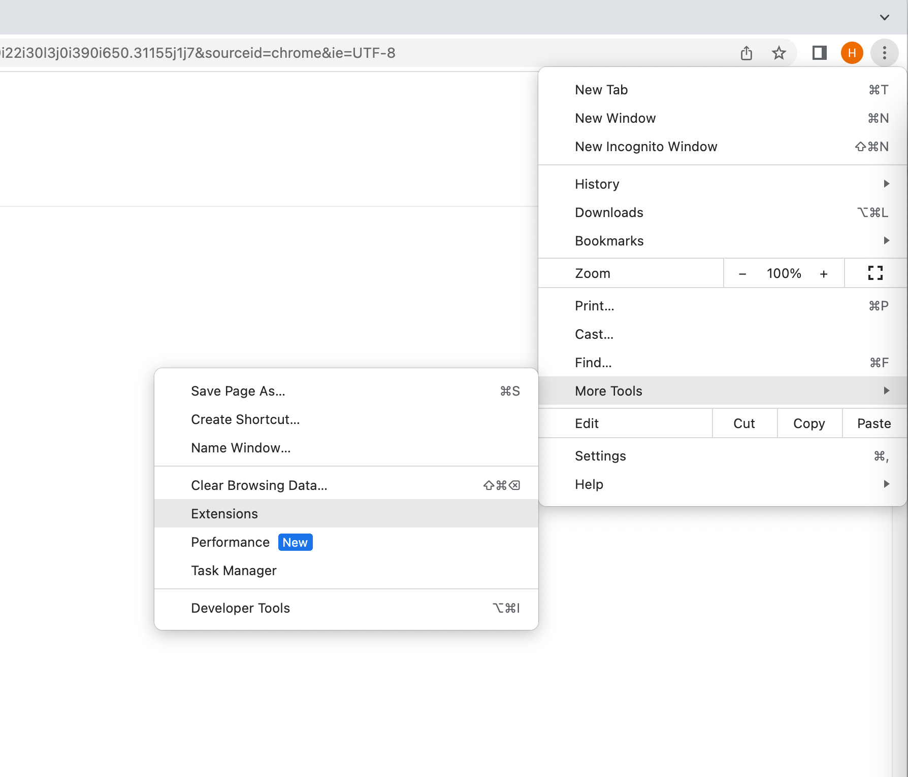
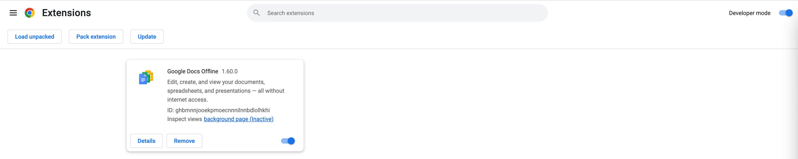
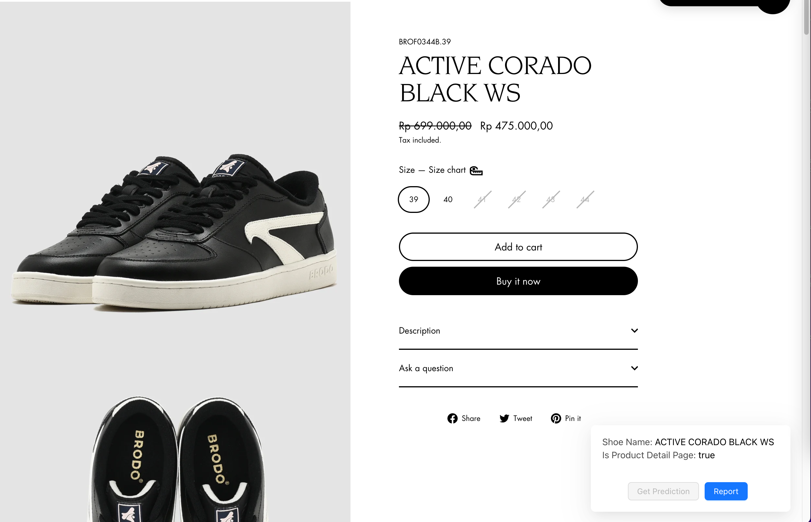

# Install the extension on the Chrome browser

Goto Chrome Settings using three dots on the top right corner.

Now, Enable developer mode.

Click on Load Unpacked and select the ShoesPredictionExtension folder.
The extension will be installed now.

Open a new Chrome tab to see the extension works at the bottom right corner.
